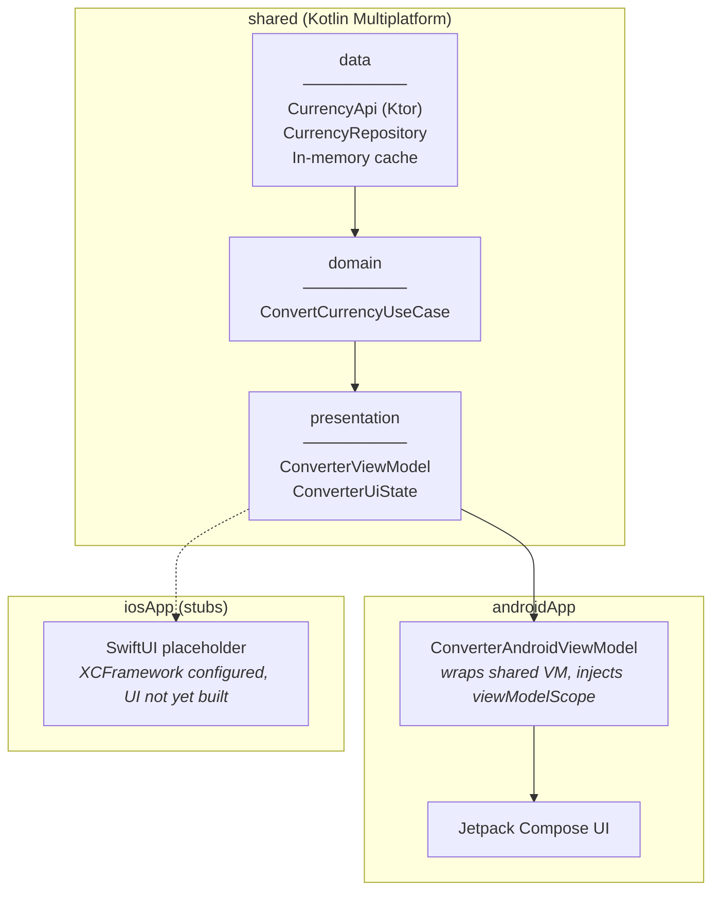

# KMP Currency Converter

A currency converter built with Kotlin Multiplatform — not to ship a product, but to
demonstrate how I think about shared business logic across platforms. This is one piece
in a portfolio series, each targeting a different competency expected of a senior mobile
engineer.

<!-- TODO: Add a screenshot of the Android app mid-conversion
     (amount entered, currencies selected, result card visible).
     Save it to docs/screenshot.png, then uncomment the line below.
     A single static screenshot is enough — this isn't a product listing.


-->

<!-- TODO: Review the "Why This Project Exists" section below — it was drafted based
     on inference, not your words. Adjust the tone and details to sound like you. -->

<!-- TODO: Once other portfolio repos exist, add a "See Also" section at the bottom
     linking to them so a hiring manager can find the full series. -->

## Why This Project Exists

I work primarily in Flutter. Building the same problem in KMP was deliberate: I wanted
to prove — to myself and to anyone reading this — that I understand cross-platform
architecture as a *pattern*, not as a framework feature. Flutter's shared UI layer is
convenient, but it can mask whether an engineer actually understands where platform
boundaries should live and how to manage them.

KMP forces those decisions to be explicit. The shared module compiles to a JVM library
for Android and a native framework for iOS. There's no shared UI — you write each
platform's UI natively and consume the shared logic. That constraint is the point.

## Architecture

The shared module owns everything except the UI: data access, domain logic, and
presentation state. Platform apps are thin wrappers that provide a UI and a lifecycle-
aware coroutine scope.



Three decisions shaped this architecture:

**CoroutineScope injection for the shared ViewModel.** The shared `ConverterViewModel`
takes a `CoroutineScope` as a constructor parameter — it never references `viewModelScope`
or any AndroidX class. On Android, the wrapper ViewModel passes its `viewModelScope`. On
iOS, you'd pass a scope tied to SwiftUI's lifecycle. In tests, you pass a
`CoroutineScope(StandardTestDispatcher())` for deterministic execution. I chose this over libraries like
moko-mvvm because it's the simplest approach that keeps the shared module completely
platform-free — no added dependencies, no expect/actual boilerplate, and the ViewModel
remains a plain Kotlin class that's trivial to test.

**Mutex-guarded caching with double-check.** The `CurrencyRepository` uses a coroutine
`Mutex` to prevent thundering-herd API calls. If five conversions from USD fire
concurrently, only one HTTP request goes out; the rest wait on the lock and then read from
cache. A double-check after acquiring the lock prevents the race between the initial cache
miss and lock acquisition. This matters less in a single-user app than in a backend
service, but it demonstrates the pattern correctly — and I wrote a
[concurrency test](shared/src/commonTest/kotlin/com/hendramarihot/currencyconverter/data/CurrencyRepositoryTest.kt)
that fires five async requests and asserts exactly one API call.

**Atomic state updates via `MutableStateFlow.update {}`.**  All ViewModel state mutations
use the `update {}` lambda instead of direct `.value` assignment. This avoids non-atomic
read-modify-write races when multiple coroutines mutate state concurrently. It's a small
thing, but getting it wrong causes the kind of subtle, intermittent bugs that only show up
under load.

## Key Technical Decisions

| Decision | Over | Rationale |
|---|---|---|
| Ktor for HTTP | Retrofit + OkHttp | Ktor provides both Android (OkHttp engine) and iOS (Darwin engine) from a single API. Retrofit doesn't run on iOS. |
| Koin for DI | Hilt, Kodein, manual | Koin has first-class KMP support as of 4.0 and stays lightweight. Hilt is Android-only. Kodein works but has a smaller ecosystem. Manual DI works for this scale but doesn't demonstrate real-world patterns. |
| Hand-written fakes for tests | Mockito, MockK | `FakeCurrencyApi` implements the real `CurrencyApi` interface with configurable behavior (delay, errors, custom rates). It runs on all KMP targets — mock libraries are JVM-only. It's also more readable: the test double's behavior is explicit in the test, not hidden behind `when().thenReturn()`. |
| kotlinx.serialization | Gson, Moshi | Native Kotlin, works on all KMP targets. Gson and Moshi are JVM-only. |
| In-memory cache, no persistence | Room, SQLDelight | Rates change frequently enough that session-scoped caching is sufficient. Adding a database would increase complexity without meaningfully improving the user experience for a converter. |

## Testing

22 unit tests across three layers. Run with `./gradlew :shared:testDebugUnitTest`.

**What's tested:**
- Repository caching logic — cache hits, cache misses, error propagation, and the
  concurrent-fetch-deduplication test described above (6 tests)
- Use case — conversion math, zero amounts, unknown currency error paths, result
  object correctness (6 tests)
- ViewModel — initial state, loading transitions, successful conversion, error states,
  currency swapping, invalid input rejection (10 tests, using `StandardTestDispatcher`
  and `advanceUntilIdle()`)

**What's deliberately not tested:**
- Compose UI (no `createComposeRule()` tests). The UI is thin enough that ViewModel tests
  cover the logic. Adding screenshot tests would be a reasonable next step.
- Ktor client configuration and JSON deserialization. These are framework internals; testing
  them would be testing Ktor, not my code.

## Non-Goals

These are scoping decisions, not gaps:

- **iOS UI.** The shared XCFramework builds and the consuming pattern is documented, but
  the SwiftUI side is stubs. This project demonstrates the shared architecture layer; a
  full iOS UI would be a separate portfolio piece about SwiftUI + KMP interop.
- **Offline mode / persistence.** Exchange rates are ephemeral. Caching for the session
  lifetime is enough. SQLDelight or Room would add complexity without teaching anything new
  about the architecture.
- **Rate refresh / staleness indicators.** The timestamp field exists in the data model
  (using `kotlinx.datetime`) but isn't surfaced in the UI. I'd add a "last updated" label
  and auto-refresh in a production app.
- **Exhaustive currency list.** 15 popular currencies are hardcoded. A production app would
  fetch the supported list from the API. Hardcoding keeps the focus on architecture.

## Limitations and What I'd Improve

- **Error messages are raw exception strings.** `"Network error"` and `"Rate not found for
  XYZ"` go straight to the Snackbar. A production app needs a proper error mapping layer
  that translates exceptions into user-friendly, localizable messages.
- **No retry logic.** A failed API call surfaces an error immediately. Exponential backoff
  with a retry button would be more resilient on flaky mobile networks.
- **No Compose previews.** Individual components (`AmountInput`, `CurrencySelector`,
  `ConversionResultCard`) don't have `@Preview` functions, making it harder to iterate on
  UI in isolation.
- **CI runs tests but doesn't report coverage.** Adding Kover and a coverage gate would
  make the test discipline more visible.

## Build and Run

```bash
# Build and install the Android app
./gradlew :androidApp:installDebug

# Run shared module tests
./gradlew :shared:testDebugUnitTest

# Build the iOS XCFramework
./gradlew :shared:assembleXCFramework
# Output: shared/build/XCFrameworks/debug/shared.xcframework
```

Requires JDK 17+ and Android SDK. Open in Android Studio for the best experience.

## Tech Stack

| Technology | Version | Role |
|---|---|---|
| Kotlin Multiplatform | 2.1.21 | Shared business logic across Android and iOS |
| Ktor | 3.1.3 | HTTP client with platform-specific engines |
| kotlinx.serialization | 1.8.1 | JSON parsing (KMP-native) |
| kotlinx.coroutines | 1.10.2 | Async operations and Flow-based state |
| kotlinx.datetime | 0.6.0 | Platform-agnostic timestamps |
| Koin | 4.0.0 | Multiplatform dependency injection |
| Jetpack Compose BOM | 2025.05.01 | Android UI (Material 3) |

## License

Copyright 2026 Hendra Marihot. [Apache License 2.0](LICENSE).
